# DLC Face Detection GitHub運用ルール

この文書は、DLC参加者がGitHubとVS Codeを使って、顔検出の実験環境を安全に利用するための手順とルールをまとめたものです。

練習用リポジトリ：

- [DLC-FaceDetection-PRE](https://github.com/Hiroyuki-Kobayashi-12/DLC-FaceDetection-PRE)

---

## 1. この環境の目的

このリポジトリは、DLC26前半のWIDER FACEを用いた顔検出タスクに向けて、GitHubによる実験管理を練習するための環境です。

参加者は、自分のsandboxブランチを作成し、GitHubとVS Codeの基本操作や、実験履歴の管理方法を実際に試します。

主な練習内容は次のとおりです。

- Branchを作成し、参加者ごとの作業環境を分ける
- VS Codeで変更内容と差分を確認する
- Commitで実験の変更履歴を残す
- Pushしてローカルの変更をGitHubへ反映する
- Tagで実験完了時点を記録・比較する
- Issueで課題や疑問を共有する
- Pull Requestで共通環境への改善を提案する
- Kaggleで学習し、ローカル環境で推論・評価する流れを確認する

> **まずは、この練習用リポジトリで自由に操作してみましょう。**  
> 操作を間違えたり、実験に失敗したりしても問題ありません。
>
> GitHubとVS Codeの基本操作を確認できたら、本番リポジトリへ移動し、実際の顔検出実験を始めましょう。
>
> **本番リポジトリ：**  
> [後日、本番リポジトリのURLを記載]

---

## 2. リポジトリの基本構成

```text
DLC-FaceDetection-PRE/
├── data/
├── kaggle_line/
├── results/
├── tools/
├── .gitignore
└── README.md
```

### `data/`

WIDER FACEの学習・評価で使用するデータ、アノテーション、Easy・Medium・Hardの評価情報、評価スクリプトなどを配置します。

データ本体は容量が大きいため、原則としてGitHubへ登録しません。

### `kaggle_line/`

Kaggle Notebookへ貼り付けて使用する学習コードを配置します。

モデル、Loss、Optimizer、Scheduler、Transform、ハイパーパラメータなどは、各参加者のsandboxブランチ上で自由に変更できます。

### `tools/`

ローカル環境で使用する推論、評価、可視化のコードを配置します。

### `results/`

現在の実験で生成した評価結果、実験サマリー、代表的な可視化、モデルの保存先情報などを記録します。

大容量モデルや大量の可視化ファイルをGitHubへ登録するかどうかは、ファイルサイズと利用条件を確認して判断します。

---

## 3. Gitの役割

### `main`

`main`は、全参加者が実験を開始するための安定した基準環境です。

`main`では、次の状態を維持します。

- 新しい参加者がCloneできる
- Kaggle学習の構成を確認できる
- ローカルで推論・評価できる
- Easy AP、Medium AP、Hard APを計算できる
- 実行方法をREADMEから確認できる
- 年度ごとに記録を残す

原則として、`main`へ直接Commit・Pushしません。

### `sandbox/<参加者名>`

参加者ごとに、日常的な実験を行う長寿命ブランチを作成します。

```text
main
├── sandbox/kobayashi
├── sandbox/sato
└── sandbox/<新しい参加者名>
```

sandboxでは、次の変更を許容します。

- モデルの変更
- Loss、Optimizer、Schedulerの変更
- TransformやData Augmentationの変更
- ハイパーパラメータの変更
- Kaggle学習コードの変更
- 評価・可視化方法の試行
- 実験途中の状態
- 失敗した実験
- 一時的に動かない状態

実験ごとに新しいブランチを増やさず、原則として同じsandboxブランチで継続して実験します。
自由に実験を実施し、記録を残していきましょう。

---

## 4. 初回準備

### 4.1 必要なもの

- GitHubアカウント
- Git
- Visual Studio Code
- VS Code拡張機能 `Git Graph`
- VS Code拡張機能 `GitLens`
- Kaggleアカウント
- ローカル評価に必要なPython環境
- その他Gitで有効なツールがあれば各自で導入

### 4.2 Collaboratorの招待を受ける

リポジトリ所有者からCollaboratorの招待を受け、GitHubで承認します。
GitHubの名前を連絡してください。

Publicリポジトリは誰でも閲覧できますが、元リポジトリへ参加者ブランチやTagをPushするには書き込み権限が必要です。

<p align="center">
    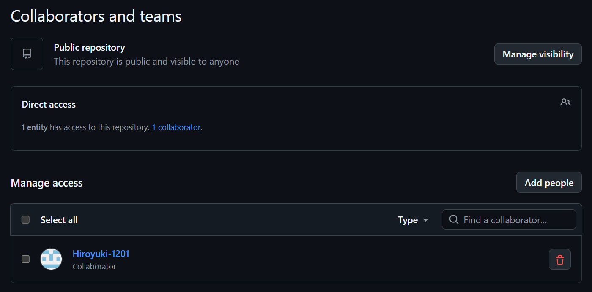
<p align="center">
    <em>リポジトリへCollaboratorを招待する画面</em>
</p>

### 4.3 VS CodeでCloneする

1. GitHubのリポジトリ画面を開く
2. `Code`を選択する
3. `HTTPS`のURLをコピーする
4. VS Codeを開く
5. コマンドパレットを開く(Ctrl+Shift+P)
6. `Git: Clone`を選択する
7. URLを貼り付ける
8. 保存先を選択する
9. Cloneしたフォルダを開く

<p align="center">
    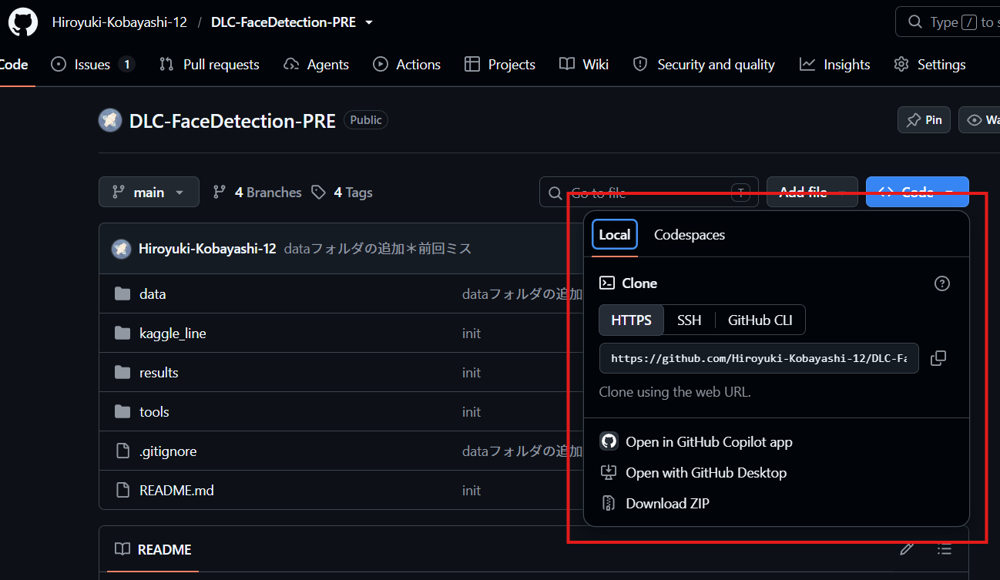
<p align="center">
    <em>GitHub 'Code'ボタンを押下</em>
</p>

<p align="center">
    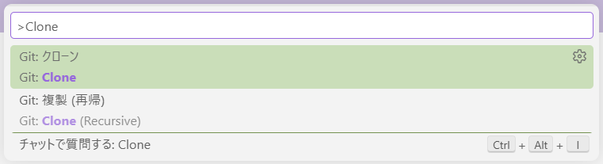
<p align="center">
    <em>コマンドパレットでGit: Cloneを選択</em>
</p>

<p align="center">
    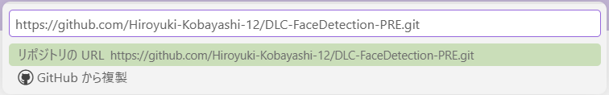
<p align="center">
    <em>URLを貼り付けGitHubをCloneする</em>
</p>


---

## 5. 自分のsandboxブランチを作る

### 5.1 `main`へ移動する

VS Code左下のブランチ名を選択し、`main`へ切り替えます。

<p align="center">
    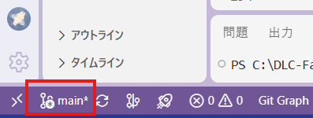
<p align="center">
    <em>Git上での現在地がここに表記される</em>
</p>

### 5.2 最新状態を取得する

VS Codeのソース管理画面からFetchまたはPullを実行し、GitHub上の最新状態を取得します。

- Fetch：GitHub上の最新ブランチ、Commit、Tag情報を取得する
- Pull：現在のブランチへGitHub上の変更内容を反映する

### 5.3 sandboxブランチを作成する

VS Code左下のブランチ名を選択し、`新しいブランチの作成`を選びます。

<p align="center">
    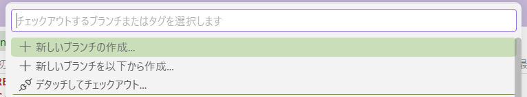
<p align="center">
    <em>新しいブランチの作成ボタン</em>
</p>

ブランチ名は次の形式にします。

```text
sandbox/<参加者名>
```

例：
<p align="center">
    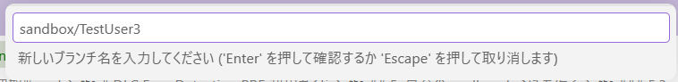
<p align="center">
    <em>新しいブランチを作成</em>
</p>

<p align="center">
    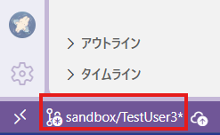
<p align="center">
    <em>作成後現在地が新規ブランチになっているか確認</em>
</p>

作成元は`main`を選択します。
＊作成元からブランチは派生します。

### 5.4 ブランチをGitHubへ公開する

ローカルでブランチを作成しただけでは、GitHub上には存在しません。

VS Codeに表示される`ブランチの発行`または`Publish Branch`を選択し、GitHubの`origin`へブランチを公開します。

<p align="center">
    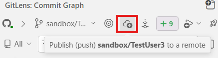
<p align="center">
    <em>Git Lens ブランチ発行ボタン</em>
</p>

<p align="center">
    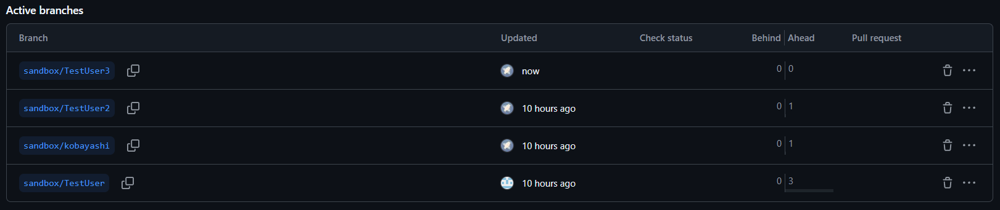
<p align="center">
    <em>GitHub上で新規ブランチが反映</em>
</p>

---

## 6. 日常の実験手順

### 6.1 作業前に現在のブランチを確認する

VS Code左下が、自分のsandboxブランチになっていることを確認します。

```text
sandbox/kobayashi
```

`main`や他の参加者のsandboxで作業しないでください。

### 6.2 Kaggle用コードを利用する

`kaggle_line/`には、Kaggle Notebookで使用するコードをセル単位で配置します。

各ファイルの内容を、対応するKaggle Notebookのセルへ順番に貼り付けて実行することで、同じ学習環境を再現できます。

### 6.3 差分を確認する

VS Codeのソース管理を開き、変更されたファイルを選択します。

差分画面で、変更前と変更後を確認します。

- `M`：変更されたファイル
- `U`：新しく追加されたファイル
- `D`：削除されたファイル

### 6.4 ステージする

Commitへ含めるファイルの`+`ボタンを選択します。

変更ファイルが`Changes`から`Staged Changes`へ移動したことを確認します。

### 6.5 Commitする

Commitメッセージには、何を変更したかを簡潔に記載します。

例：

```text
experiment: 入力画像サイズを変更 #3
experiment: Focal Lossを追加 #3
experiment: Scheduler設定を変更 #3
fix: 評価時の座標変換を修正 #5
```

Issueと関連する変更では、CommitメッセージへIssue番号を記載します。

### 6.6 GitHubへ反映する

Commitは、最初にローカルGitへ保存されます。

```text
Commit
└── ローカルにだけ保存
```

他の参加者やGitHubから確認できるようにするには、必ずPushまたは変更の同期を実行します。

```text
Commit
↓
Push／変更の同期
↓
origin/sandbox/<参加者名>へ反映
```

VS Codeで`変更の同期 1↑`などが表示されている場合、GitHubへ送信していないCommitがあります。

同期後は、Git Graph上でローカルブランチと`origin`側のブランチが同じCommitを指していることを確認します。

<p align="center">
    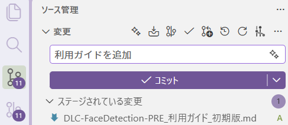
<p align="center">
    <em>ステージ後、コミットメッセージを記入</em>
</p>

<p align="center">
    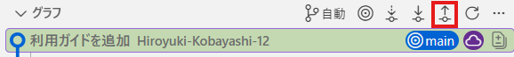
<p align="center">
    <em>プッシュボタンを押下しGitHubへ反映</em>
</p>

> 重要：ローカルでCommitしただけでは、GitHubには反映されません。作業を共有する場合は、必ずPushまたは変更の同期まで実施してください。

---

## 7. Kaggleで学習する

1. GitHub上で自分のsandboxブランチを開く
2. `kaggle_line/`のコードを確認する
3. 対応するKaggle Notebookのセルへ反映する
4. WIDER FACE Trainで学習する
5. 学習済みモデルと学習履歴を保存する
6. Kaggle上で追加変更した場合は、同じ変更をsandboxブランチへ戻す
7. 変更をCommitし、GitHubへPushする

Kaggle上だけに存在するコード変更を残さないようにします。

---

## 8. ローカルで推論・評価する

Kaggleで生成した学習済みモデルを取得し、ローカル環境でWIDER FACE Validationへの推論と評価を行います。

評価指標は次の3つです。

- Easy AP
- Medium AP
- Hard AP

評価後は、次の情報を`results/`へ記録します。

- 実験ID
- 使用したデータセット
- 学習条件
- 評価条件
- Easy AP
- Medium AP
- Hard AP
- 学習済みモデルの保存先
- モデルのハッシュまたは識別情報
- 代表的なグラフ
- 分かったこと
- 失敗したこと
- 次に試したいこと

実験結果を自由に記録していきましょう！
人に説明できる根拠を残すことを意識するとよいです。
大量の予測ファイルや大容量モデルをGitHubへ入れる場合は、必ず事前に共有方法を確認します。

---

## 9. 実験をTagで記録する

### 9.1 Tagの役割

細かな試行錯誤はCommitで残し、学習・評価・可視化まで一区切りついた時点にTagを付けます。

```text
Commit
└── 途中の変更履歴

Tag
└── 再現・比較したい実験完了時点
```

Tag名は次の形式にします。

```text
exp/<参加者名>/<3桁の連番>-<Easy APの整数値>%
```

例：

```text
exp/kobayashi/001-073%
exp/kobayashi/002-080%
exp/sato/001-099%
```

### 9.2 Git GraphでTagを作る

1. 実験結果までCommitする
2. Pushまたは変更の同期を行う
3. Git Graphを開く
4. 実験完了Commitを右クリックする
5. `Add Tag`を選択する
6. Typeは`Annotated Tag`を選択する
7. Tag名を入力する
8. Tagメッセージを入力する
9. 作成したTagを右クリックする
10. `Push Tag`を選択する
11. Push先に`origin`を選択する

<p align="center">
    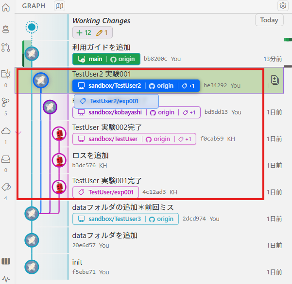
<p align="center">
    <em>実験完了CommitにTagを追加</em>
</p>

> Tagもローカルで作成しただけではGitHubに反映されません。作成後は必ず`Push Tag`を実行してください。

---

## 10. 実験Tagを比較する

Experiment間の差分はGitLensを使用して確認します。

1. VS CodeでGitLensを開く
2. `Search & Compare`または`Compare References`を開く
3. 比較元のTagを選ぶ
4. 比較先のTagを選ぶ
5. 変更されたファイル一覧を確認する
6. ファイルを選択して差分を表示する

例：

```text
exp/kobayashi/001-073%
と
exp/kobayashi/002-080%
を比較
```

主な比較対象は次のとおりです。

- Modelの変更
- Lossの変更
- Optimizerの変更
- Schedulerの変更
- Transformの変更
- ハイパーパラメータの変更
- Easy AP、Medium AP、Hard APの変化
- 可視化結果の変化

<p align="center">
    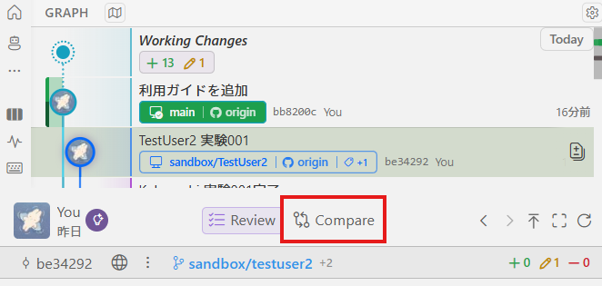
<p align="center">
    <em>GitLensのCompareボタン</em>
</p>
<p align="center">
    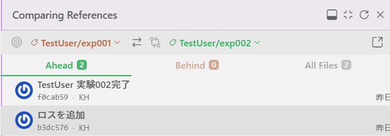
<p align="center">
    <em>Tag同士の比較</em>
</p>

---

## 11. Issueの使い方(未確定)

Issueは実験番号としてではなく、課題、疑問、仮説、相談事項、改善テーマを管理するために使用します。

### Issueの例

- Hard APが改善しない
- Kaggleとローカルで結果が一致しない
- 評価結果の可視化に不具合がある
- Datasetの扱いを整理したい
- 複数回の実験が必要なテーマ
- 他の参加者に相談したい
- mainの共通環境を改善したい

### Commitとの関連付け

CommitメッセージへIssue番号を記載します。

```text
experiment: Focal Lossを追加 #3
```

### Tagとの関連付け

実験完了後、IssueのコメントへTag名と結果を記載します。

```markdown
## 実験結果

関連Tag：`exp/kobayashi/001-073%`

- Easy AP：
- Medium AP：
- Hard AP：

### 分かったこと

### 次に試すこと
```

1つのIssueに、複数人、複数の実験Tagを関連付けて構いません。

### 推奨ラベル

```text
scope: personal
scope: team
scope: main

area: training
area: dataset
area: evaluation
area: visualization
area: environment
area: git

status: blocked
status: needs-help
status: needs-review
```

最初からすべてのラベルを作らず、必要になったものから追加します。

<!-- 画像予定：GitHubでIssueを作成する画面 -->
<!-- 画像予定：Issue番号を含むCommit -->
<!-- 画像予定：IssueへTagと評価結果を追記した画面 -->

---

## 12. Pull Requestの使い方(未確定)

sandboxで行ったすべての実験をmainへMergeする必要はありません。

mainへ戻すのは、他の参加者にも有効な改善です。

例：

- 学習コードのバグ修正
- 評価コードの改善
- 可視化処理の改善
- 共通利用できるLossやScheduler
- データパス処理
- READMEや手順書の改善
- 安定したBaseline設定

Pull Requestには次を記載します。

```markdown
## 変更内容

## 関連Issue

Related to #3

## 関連実験Tag

`exp/kobayashi/001-073%`

## 評価結果

- Easy AP：
- Medium AP：
- Hard AP：

## mainへ反映したい理由

## 確認してほしいこと
```

IssueをmainへのMergeによって解決する場合だけ、Pull Request本文に次を記載します。

```text
Fixes #3
```

<!-- 画像予定：Pull Request作成画面 -->
<!-- 画像予定：Reviewer指定画面 -->
<!-- 画像予定：Files changedの差分確認画面 -->

---

## 13. 他の参加者の作業を確認する

### Fetchする

他の参加者がPushしたブランチ、Commit、TagをVS Codeへ取得するにはFetchを実行します。

VS Codeのコマンドパレットから`Git: Fetch`を選択するか、Git GraphのFetch操作を使用します。

FetchはGitHub上の最新情報を取得しますが、現在の作業ファイルは変更しません。

### ブランチを確認する

Git GraphまたはGitLensで、次のようなリモートブランチを表示します。

```text
origin/sandbox/sato
origin/sandbox/suzuki
```

確認だけの場合は、Git GraphやGitLensからCommitと差分を確認します。

他の参加者のブランチへ切り替えて確認する場合は、未Commitの変更がないことを確認してから実施します。確認後は、自分のsandboxブランチへ戻ります。

<!-- 画像予定：Git GraphのFetchボタン -->
<!-- 画像予定：他の参加者のoriginブランチ -->
<!-- 画像予定：他ブランチのCommit詳細 -->

---

## 14. ローカルとoriginの違い

Gitでは、PC内の履歴とGitHub上の履歴を区別します。

```text
sandbox/kobayashi
└── ローカルPC上のブランチ

origin/sandbox/kobayashi
└── GitHub上のブランチ
```

`origin`は余分なブランチではなく、GitHub側の状態を表す名前です。

### 正常な共有状態

```text
sandbox/kobayashi
origin/sandbox/kobayashi
```

この2つがGit Graph上で同じCommitを指していれば、ローカルの変更がGitHubへ反映されています。

### 未Pushの状態

ローカル側だけが先へ進み、`1↑`などが表示されている場合、GitHubへ送信していないCommitがあります。

Pushまたは変更の同期を実行してください。

---

## 15. 禁止事項・注意事項

### mainへ直接Pushしない

共通環境を変更する場合は、sandboxまたは一時ブランチで作業し、Pull Requestを作成します。

### 他の参加者のsandboxを変更しない

確認することはできますが、本人の同意なくCommitやPushを行わないでください。

### 大容量データをCommitしない

次のようなファイルは、原則としてGitHubへ登録しません。

- WIDER FACE画像本体
- 大量の予測結果
- キャッシュ
- 一時ファイル
- 大容量モデル
- 大量の可視化結果

### 秘密情報をCommitしない

次をGitHubへ登録しないでください。

- Kaggle API Token
- `kaggle.json`
- パスワード
- アクセストークン
- `.env`
- 個人情報
- 社内限定情報

### Commit前に対象を確認する

VS Codeのソース管理で、ステージ対象にデータや秘密情報が含まれていないことを確認します。

---

## 16. Experiment完了チェックリスト

Tagを付ける前に、次を確認します。

- [ ] 使用データを特定できる
- [ ] Kaggle学習コードがCommitされている
- [ ] Kaggle上だけの変更が残っていない
- [ ] 学習設定とSeedが記録されている
- [ ] 学習済みモデルの保存先が記録されている
- [ ] ローカル評価を再実行できる
- [ ] Easy APが記録されている
- [ ] Medium APが記録されている
- [ ] Hard APが記録されている
- [ ] 代表的な可視化が保存されている
- [ ] 分かったことと失敗したことが記録されている
- [ ] 関連Issueが記録されている
- [ ] すべての変更をCommitした
- [ ] sandboxブランチをoriginへPushした
- [ ] Annotated Tagを作成した
- [ ] TagをoriginへPushした

---

## 17. 困ったとき

### 他の人の変更が見えない

Fetchを実行します。

### CommitしたのにGitHubへ反映されない

Commitはローカル保存です。Pushまたは変更の同期を実行します。

### TagがGitHubへ反映されない

Tagを右クリックし、`Push Tag`から`origin`へPushします。

### Branchを切り替えられない

未Commitの変更が残っていないか、VS Codeのソース管理で確認します。

### dataが大量にステージされた

Commitせず、`.gitignore`の設定とステージ状態を確認します。

### 操作に迷った

Issueを作成し、`status: needs-help`または`area: git`を付けて相談します。

---

## 18. 最小の運用ルール

参加者は、まず次の流れを守ってください。

1. `main`から自分の`sandbox/<名前>`を作る
2. 作業前に現在のブランチを確認する
3. 変更を小さな単位でCommitする
4. Commit後はPushまたは変更の同期を行う
5. 疑問や課題はIssueに記録する
6. CommitへIssue番号を含める
7. 実験完了時にAnnotated Tagを作る
8. TagもoriginへPushする
9. 共通化できる改善はPull Requestでmainへ提案する
10. データ、秘密情報、大容量成果物を誤ってCommitしない

---

## 19. 用語

### Branch

作業環境を分けるものです。本プロジェクトでは、参加者ごとのsandboxを作ります。

### Commit

ローカルGitへ変更履歴を保存する操作です。CommitだけではGitHubへ反映されません。

### Push

ローカルのCommitやTagをGitHubのoriginへ送る操作です。

### Fetch

GitHubの最新Branch、Commit、Tag情報をローカルへ取得する操作です。現在の作業ファイルは変更しません。

### Pull

GitHub上の変更を、現在のローカルブランチへ取り込む操作です。

### Tag

特定のCommitへ付ける固定の目印です。本プロジェクトでは、実験完了時点を記録します。

### origin

GitHub上のリモートリポジトリを表す標準的な名前です。

### Issue

課題、疑問、仮説、相談、改善テーマを継続的に管理する場所です。

### Pull Request

sandboxや一時ブランチの変更をmainへ提案し、レビューとディスカッションを行う仕組みです。
